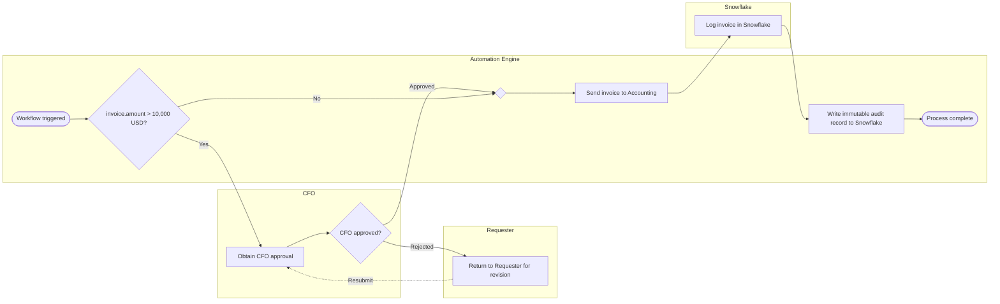

# The Schema Dictionary

The artefact a BA hands an integrator. One row per compiled step, showing the
phrase that produced it and the exact backend call it maps to.

Everything below is generated output, not an illustration — regenerate it with
`node tests/run.js` and the Dictionary tab in the app, or read the raw JSON at
[`artifacts/invoice-workflow.json`](artifacts/invoice-workflow.json).

---

## Source sentence

> Send the invoice to accounting, if it is over $10k get CFO approval first,
> then log it in Snowflake

## Answers given during the clarification loop

| Question | Rule | Answer |
|---|---|---|
| When `invoice.amount > 10,000 USD` is false, what happens? | `R-ELSE` | Continue with the rest of the process |
| If the CFO rejects, what happens? | `R-NO-REJECT-PATH` | Return to the requester for revision, then resubmit |
| Where should the decision record be written? | `R-AUDIT` | Also write to Snowflake |
| How long may the CFO approval wait? | `R-NO-SLA` | 1 business day, then escalate |
| If the Snowflake call fails? | `R-NO-RETRY` | Retry 3× with exponential backoff, then dead-letter |

## The mapping

| Phrase from the sentence | Recognised as | Performer | Binding | Backend contract |
|---|---|---|---|---|
| _structure_ | `event.start` | Automation Engine | `manual:manual` | — |
| "if it is over $10k get CFO approval first" | `gateway.exclusive` | Automation Engine | `invoice.amount > 10,000 USD` | `EVAL /engine/decide` |
| "get CFO approval first" | `task.approval` | CFO | `humanTask.assign(role_cfo)` | `POST /tasks/human` |
| _clarification_ | `gateway.exclusive` | CFO | `n1.then.outcome = approved` | `EVAL /engine/decide` |
| _clarification_ | `task.assign` | Requester | `humanTask.assign(role_requester)` | — |
| "Send the invoice to accounting" | `task.notify` | Automation Engine | `notify → Accounting` | `POST /notifications/send` |
| "log it in Snowflake" | `task.data.write` | Snowflake | `Snowflake.record.insert` | `POST /connectors/sys_snowflake/record/insert` |
| _clarification_ | `task.audit` | Automation Engine | `Snowflake.ledger.append` | `POST /connectors/sys_audit/ledger/append` |
| _structure_ | `end` | Automation Engine | `—` | — |

Three origins appear in the first column:

- **A quoted phrase** — this step exists because you wrote those words.
- **_clarification_** — this step exists because you answered a question. It was
  not in your sentence.
- **_structure_** — a merge point or end event the compiler adds to keep the
  graph well-formed.

Keeping these visibly distinct is the point of the table. A reviewer can see at
a glance which parts of the workflow came from policy and which came from the
engine filling a gap under supervision.

---

## How a condition becomes a runtime test

```
  "if it is over $10k"
        │
        ├─ condition cue      "if"
        ├─ subject            "it"        → pronoun
        │                                 → nearest preceding object = invoice
        │                                 → invoice has amountField
        │                                 → invoice.amount            [inferred: true]
        ├─ comparator         "over"      → gt
        │                                   (chosen over the stray "is" → eq,
        │                                    because comparator classes are
        │                                    tried in specificity order)
        └─ value              "$10k"      → { value: 10000, currency: "USD" }
```

emitting

```json
{
  "id": "n1",
  "type": "gateway.exclusive",
  "name": "invoice.amount > 10,000 USD?",
  "condition": {
    "unresolved": false,
    "subject": "invoice.amount",
    "subjectInferred": true,
    "operator": "gt",
    "value": 10000,
    "valueType": "money",
    "currency": "USD",
    "negated": false,
    "source": "parsed"
  },
  "trace": { "clause": "if it is over $10k get CFO approval first", "hoisted": true }
}
```

`subjectInferred: true` and `hoisted: true` are both load-bearing. The first
tells a reviewer the field name was carried over rather than stated; the second
records that this gate was moved ahead of the clause written before it because
of the word "first".

## How a step becomes an API call

A `task.data.write` bound to a registered connector emits a complete request
contract:

```json
{
  "connectorId": "sys_snowflake",
  "connector": "Snowflake",
  "operation": "record.insert",
  "payload": {
    "objectType": "invoice",
    "objectId": "{{invoice.id}}",
    "amount": "{{invoice.amount}}",
    "correlationId": "{{workflow.correlationId}}",
    "emittedBy": "{{workflow.id}}"
  }
}
```

→ `POST /connectors/sys_snowflake/record/insert`

The mustache bindings are resolved by a runtime against the workflow context.
**No such runtime exists in this repository** — see
[limitations.md](limitations.md#the-engine-compiles-it-does-not-execute).

## Human tasks

An approval compiles to a task contract rather than a system call:

```json
{
  "method": "POST",
  "endpoint": "/tasks/human",
  "body": {
    "assignee": "role_cfo",
    "subject": "Obtain CFO approval",
    "dueInSeconds": 86400,
    "onBreach": "escalate",
    "outcomes": ["approved", "rejected"]
  }
}
```

`outcomes` contains both values only because `R-NO-REJECT-PATH` was answered.
Before that answer it reads `["approved"]` — an accurate description of a
workflow in which rejection does nothing.

## The compiled flow


