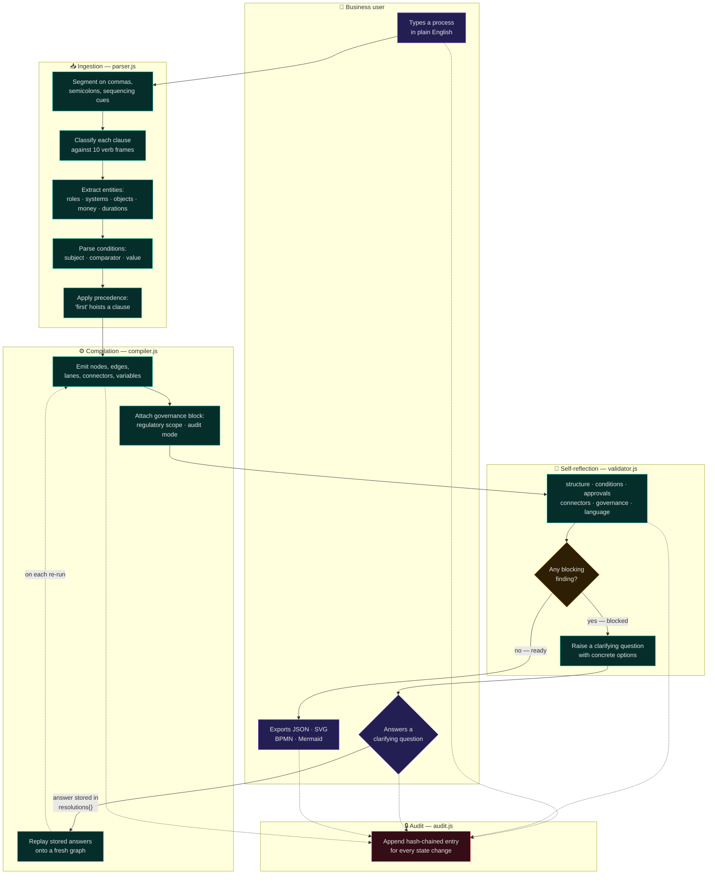
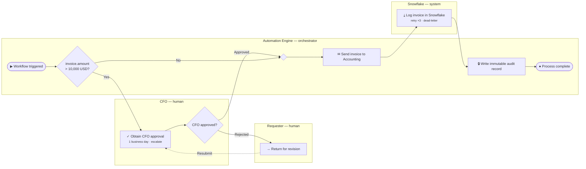

# Visual blueprint — a prompt's journey into functional logic

Two diagrams. The first is the **translation pipeline**: what happens to a
sentence between the textarea and the compiled JSON. The second is a
**compiled process** — the output the pipeline produces.

---

## 1. The translation pipeline

Lanes are the actors in the translation itself. Note that the loop back to the
Business User is the only path out of `blocked` — there is no route from an
under-specified sentence to a compiled workflow that does not pass through a
human answering a question.

### What each stage guarantees

| Stage | Guarantee | Enforced by |
|---|---|---|
| Ingestion | Anything unparseable becomes an explicit `unresolved` marker, never a guess. | `parser · conditions › marks an unevaluable predicate rather than guessing` |
| Compilation | Pure function of `(parsed, resolutions)` — same inputs, byte-identical output. | `compiler · graph › is deterministic` |
| Compilation | Node ids derive from clause position, so inserting nodes never renumbers existing ones. | `compiler · graph › keeps node ids stable…` |
| Self-reflection | Runs over the *graph*, so it catches dangling edges as well as missing currencies. | `validator · rules › catches an unreachable node` |
| Self-reflection | The same question is never asked twice; the loop always makes progress. | `validator · convergence › answering a question never introduces…` |
| Audit | Every state change is chained; editing history breaks verification. | `audit ledger › detects an edited payload` |

### Why the loop recompiles instead of patching

An answer is stored as a key in a plain `resolutions` object and the workflow is
rebuilt **from the original sentence** every time. There is never a
half-mutated graph anywhere.

Three properties fall out of that choice:

1. **Undo is free.** Withdrawing an answer is deleting a key, and the earlier
   workflow returns byte-identical.
2. **The output is fully explained.** Sentence + visible answer list = the whole
   workflow. Nothing came from anywhere else.
3. **Answers are portable.** The `resolutions` object is serialised into the
   exported JSON, so replaying a compile elsewhere reproduces the same document.

---

## 2. A compiled process

The output for the flagship sentence, after the five clarifying questions have
been answered. Lanes here are the *participants in the business process* — a
different axis from the pipeline diagram above.

> Send the invoice to accounting, if it is over $10k get CFO approval first,
> then log it in Snowflake

### Reading the diagram against the sentence

| What you see | Where it came from |
|---|---|
| The decision sits **before** the send | `"first"` in the sentence hoisted the whole conditional ahead of the clause written before it |
| The subject is `invoice.amount` | `"it"` bound to the nearest preceding object; reported as an informational finding |
| `> 10,000 USD` | `"over"` beat the stray `"is"` on comparator specificity; `$10k` carried its own currency |
| The **CFO approved?** gateway | Did not come from the sentence. Answering `R-NO-REJECT-PATH` created it. |
| The **Resubmit** loop edge | The "return for revision" answer, compiled as a genuine back-edge |
| The **audit record** step | Answering `R-AUDIT`; the flow was in `financial-controls` scope with no audit write |
| The SLA and retry badges | Answers to `R-NO-SLA` and `R-NO-RETRY` |

Six of the eleven boxes exist because a question was answered. The Dictionary
tab marks every one of them, so nobody signs off a diagram believing it all came
out of their sentence.

Raw exports of this workflow:
[JSON](artifacts/invoice-workflow.json) ·
[BPMN 2.0](artifacts/invoice-workflow.bpmn) ·
[Mermaid](artifacts/invoice-flow.mmd) ·
[before clarification](artifacts/invoice-workflow.unclarified.json)
